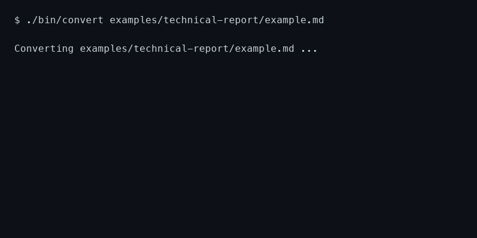
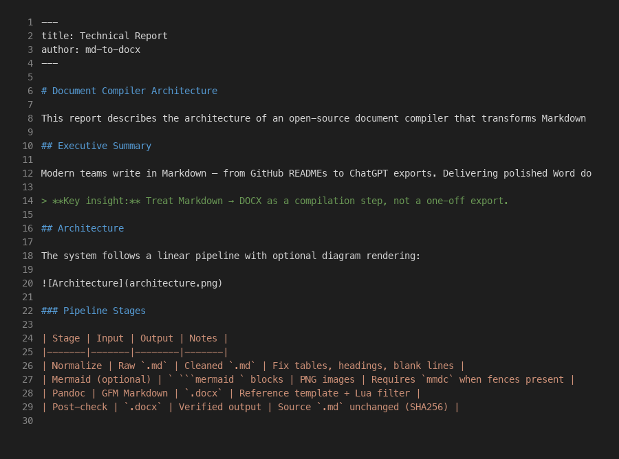
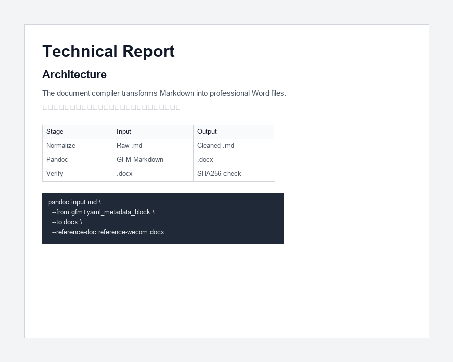
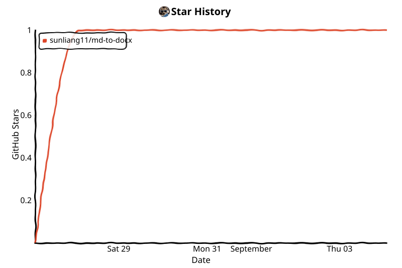

English | [中文](README.zh.md)

[](LICENSE)
[](https://github.com/sunliang11/md-to-docx/actions/workflows/ci.yml)


# md-to-docx


**The open-source document compiler for the AI era.**

Turn Markdown and AI-generated content into professional Word documents.

[Documentation](references/installation.md) · [Examples](examples/README.md) · [GitHub](https://github.com/sunliang11/md-to-docx)



**Before** (Markdown) → **After** (Word)

 

## Quick Start

```bash
git clone https://github.com/sunliang11/md-to-docx.git
cd md-to-docx
./bin/convert path/to/report.md
```

**Pipeline:** Markdown / AI output → md-to-docx → Professional DOCX

## Features

- Headings, lists, tables, code blocks, blockquotes, images
- CJK-aware reference template
- Mermaid diagrams → PNG
- Batch directory conversion
- Cursor Agent Skill
- WeCom smart-doc import (optional workflow)

## What's next

- **v0.2** — Native Document AST ([roadmap](references/roadmap.md))
- **v0.3** — Template presets (academic, business, API)
- **v0.4+** — AI-native entry points (planned, not yet available)

## Install

### Requirements

- **Python 3.10+**
- **pandoc 3.x** — Markdown → DOCX conversion
- **mmdc** (optional) — Only when `.md` contains ` ```mermaid ` blocks

### From source (recommended)

```bash
git clone https://github.com/sunliang11/md-to-docx.git
cd md-to-docx
./bin/convert report.md
./bin/convert ./docs          # directory (recursive)
```

### Editable install (optional)

```bash
pip install -e .
```

Not published on PyPI — the package name `md-to-docx` belongs to a different project.

## Run

```bash
# Convert a single file
python -m md_to_docx report.md

# Convert a directory (recursive)
python -m md_to_docx ./docs

# With options
python -m md_to_docx ./docs --exclude "README.md" --output-dir ./output
```

CLI options:

- `--version` — Show version
- `--exclude PATTERN` — Exclude files matching pattern (can be used multiple times)
- `--output-dir DIR` — Write .docx files to a specific directory
- `--skip-existing` — Skip conversion if output already exists
- `--dry-run` — Preview what would be converted

By default, excludes `README.md`, `CHANGELOG.md`, `SKILL.md`, and `.github/**`. Automatically skips `.git` and `node_modules`.

## Documentation

- [Installation & troubleshooting](references/installation.md)
- [Examples gallery](examples/README.md)
- [Roadmap](references/roadmap.md)
- [Environment variables](references/configuration.md)
- [WeCom import guide](references/wecom-import.md)
- [Development & tests](references/development.md)

**Entry points:** Human visitors use `README.md` / `README.zh.md`; Cursor agents use [SKILL.md](SKILL.md); detailed docs live under `references/`.

## Cursor Skill

Symlink this repo to `~/.cursor/skills/md-to-docx` to use as a Cursor Agent skill:

```bash
ln -sfn /path/to/md-to-docx ~/.cursor/skills/md-to-docx
```

See [SKILL.md](SKILL.md) for agent instructions.

## License

MIT — see [LICENSE](LICENSE).

---

## Star History

GitHub restricted public stargazer API access in 2026, so hosted `api.star-history.com` badges no longer work for most repos. This chart is generated by [`.github/workflows/star-history.yml`](.github/workflows/star-history.yml) and committed into the repo.

<!-- star-history:start -->
<picture>
  <source media="(prefers-color-scheme: dark)" srcset="assets/star-history/star-history-dark.svg">
  
</picture>
<!-- star-history:end -->
