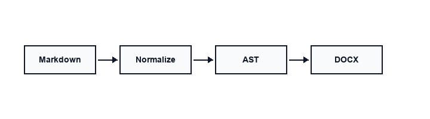

# Document Compiler Architecture

This report describes the architecture of an open-source document compiler that transforms Markdown and AI-generated content into professional Word documents.

## Executive Summary

Modern teams write in Markdown — from GitHub READMEs to ChatGPT exports. Delivering polished Word documents still requires manual copy-paste and formatting. A document compiler automates this pipeline while preserving structure, tables, code blocks, and CJK typography.

> **Key insight:** Treat Markdown → DOCX as a compilation step, not a one-off export.

## Architecture

The system follows a linear pipeline with optional diagram rendering:



### Pipeline Stages

| Stage | Input | Output | Notes |
|-------|-------|--------|-------|
| Normalize | Raw `.md` | Cleaned `.md` | Fix tables, headings, blank lines |
| Parse | Cleaned `.md` | Document AST | markdown-it-py + plugins |
| Transform | Document AST | Enriched AST | TOC, numbering, Mermaid/math/captions |
| Render | Document AST | `.docx` | python-docx + reference template |

### Component Responsibilities

1. **CLI layer** — discovers files, handles batch conversion, `--dry-run`, `--output-dir`
2. **Normalizer** — CJK-aware heading numbers, list spacing, code fence fixes
3. **Converter** — parses Markdown to Document AST and renders DOCX
4. **Reference template** — YaHei body, Consolas code, compact table style

## Implementation Details

### Normalization Rules

The normalizer applies deterministic transforms before parsing:

```python
class MarkdownNormalizer:
    def normalize(self, text: str) -> str:
        text = self._fix_tables(text)
        text = self._fix_headings(text)
        text = self._fix_code_blocks(text)
        return text
```

### Native Invocation

```bash
./bin/convert input.md --preset technical --toc --numbering
```

## Performance Characteristics

| Metric | Value | Environment |
|--------|-------|-------------|
| Single file (< 50 KB) | < 2 s | macOS, Python 3.10+ |
| Batch 100 files | < 3 min | SSD, no Mermaid |
| Mermaid per diagram | 3–8 s | Depends on `mmdc` + browser |

## Security Considerations

- Source files are never modified in place
- Temporary files use a predictable prefix and are cleaned up
- No network calls during conversion (offline-first)
- Optional Mermaid rendering via mmdc

## Internationalization

The reference template sets `zh-CN` theme language and uses Microsoft YaHei for body text. English headings and code remain in Consolas. Mixed Chinese/English paragraphs render correctly without manual font switching.

### 中文混排示例

本编译器支持中英文混排：标题可以是 English，正文可以是中文，表格和代码块保持统一风格。这对于技术团队撰写 bilingual 文档非常实用。

## Future Work

- Additional template presets and plugin hooks
- Template presets — academic, business, API reference
- Table of contents generation
- OMML math support

## Conclusion

A focused document compiler turns AI-era Markdown workflows into deliverable Word documents with one command. The architecture prioritizes reliability, offline operation, and CJK typography over feature breadth.

## References

1. md-to-docx documentation — https://github.com/sunliang11/md-to-docx
2. GitHub Flavored Markdown Spec
3. Office Open XML (OOXML) standard
