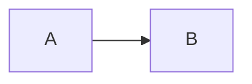

# Open Document Markdown (ODM)

**Version:** `odm-0.1`  
**Status:** Draft — describes syntax implemented by [md-to-docx](https://github.com/sunliang11/md-to-docx) native engine.

ODM is the Markdown dialect that md-to-docx compiles into professional DOCX. It extends CommonMark + GFM with document-oriented features (page breaks, captions, callouts, math, Mermaid).

---

## Base syntax

ODM builds on **CommonMark** and **GitHub Flavored Markdown (GFM)**:

- Headings (`#` … `######`)
- Paragraphs, emphasis, strong, strikethrough, inline code
- Fenced code blocks with language tags
- Bullet and ordered lists (including GFM task lists)
- Tables
- Links and images
- Blockquotes (`>`)
- Thematic breaks (`---`)

---

## YAML frontmatter

Optional YAML block at the top of the file, delimited by `---`:

```yaml
---
title: Report Title
author: Jane Doe
date: 2026-09-02
template: templates/technical-design/template.docx
toc: true
numbering: true
preset: technical
---
```

| Field | Type | Description |
|-------|------|-------------|
| `title` | string | Document title (rendered if no H1 in body) |
| `author` | string | Author name |
| `date` | string | Date string |
| `template` | string | Path to `.docx` template (apply via CLI `--template`) |
| `toc` | bool | Insert table of contents (CLI `--toc`) |
| `numbering` | bool | Number headings (CLI `--numbering`) |
| `preset` | string | Built-in preset name (CLI `--preset`) |

Fields `template`, `numbering`, and `preset` are **declared metadata**. The CLI applies them via `--template`, `--numbering`, and `--preset` flags.

---

## Page breaks

```markdown
<!-- pagebreak -->
```

Container form:

```markdown
:::pagebreak
:::
```

Both produce a `PageBreak` in the document AST and a page break in DOCX output.

---

## Callouts

Three container types with a colored left border in DOCX:

```markdown
:::warning
Important caution text.
:::

:::info
Supplementary information.
:::

:::note
A side note or remark.
:::
```

Kinds: `warning`, `info`, `note` (case-insensitive opening tag).

---

## Figures, tables, and cross-references

**Image with figure ID:**

```markdown
{#fig:arch}
```

**Table caption** (line immediately after the table):

```markdown
| A | B |
|---|---|
| 1 | 2 |

Table: Sample data {#tbl:sample}
```

**Cross-reference** (inline):

```markdown
See [@fig:arch] and [@tbl:sample] for details.
```

Kinds: `fig`, `tbl`, `sec`.

---

## Math

Inline: `$E = mc^2$`

Block:

```markdown
$$
\int_0^1 x^2 \, dx
$$
```

Rendered as OMML in DOCX (basic LaTeX via `latex2mathml`).

---

## Mermaid diagrams

````markdown

````

Rendered as embedded PNG when `mmdc` is available; otherwise emitted as a code block.

---

## Footnotes

```markdown
Text with a footnote[^note1].

[^note1]: Footnote body text.
```

---

## Non-goals (odm-0.1)

The following are **not** part of ODM and may be ignored or passed through unchanged:

- Arbitrary raw HTML (except `<!-- pagebreak -->`)
- Custom XML extensions
- PDF as a first-class output format (DOCX remains the primary target)
- Arbitrary `:::` containers beyond `pagebreak`, `warning`, `info`, `note`

---

## Versioning

| Version | Date | Changes |
|---------|------|---------|
| odm-0.1 | 2026-09-02 | Initial spec: GFM base, frontmatter, pagebreak, callouts, captions, math, mermaid, footnotes |
